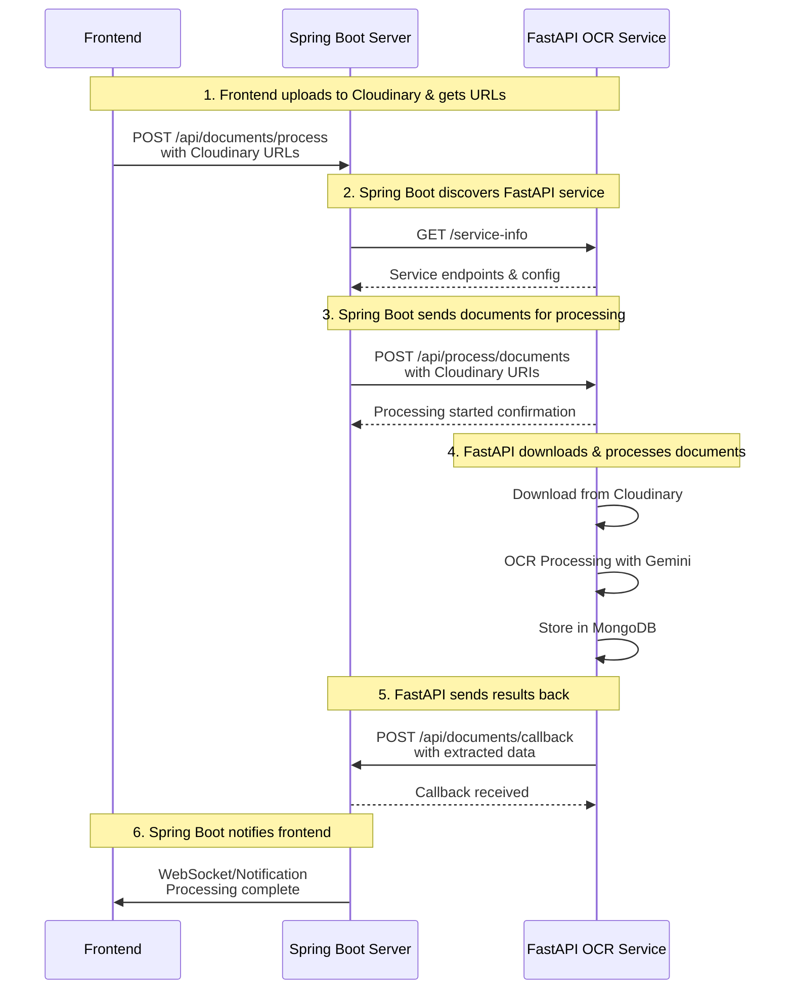

# 🔗 Complete Endpoint Reference for Spring Boot ↔ FastAPI Communication

## 📡 **FastAPI Endpoints (Your OCR Service)**

### 1. Service Discovery

```http
GET http://<fastapi-server-ip>:8000/service-info
```

**Response:**

```json
{
  "service_name": "FastAPI OCR Service",
  "host": "192.168.1.100",
  "port": 8000,
  "endpoints": {
    "health": "/health",
    "process_single": "/api/process",
    "process_batch": "/api/process/documents",
    "register_service": "/register-service"
  }
}
```

### 2. **Main Processing Endpoint** ⭐ (For Cloudinary URIs)

```http
POST http://<fastapi-server-ip>:8000/api/process/documents
```

**Request Body for Cloudinary Documents:**

```json
{
  "documents": [
    {
      "uri": "https://res.cloudinary.com/demo/image/upload/v1234567890/sample.jpg",
      "type": "image"
    },
    {
      "uri": "https://res.cloudinary.com/demo/image/upload/v1234567890/document.pdf",
      "type": "pdf"
    }
  ],
  "batch_id": "cloudinary-batch-001",
  "student_id": "STUDENT_12345",
  "callback_url": "http://<spring-boot-ip>:8080/api/documents/callback"
}
```

### 3. Health Check

```http
GET http://<fastapi-server-ip>:8000/health
```

---

## 🌐 **Spring Boot Endpoints (Your Main Server)**

### 1. **Callback Endpoint** ⭐ (Receives OCR Results)

```http
POST http://<spring-boot-ip>:8080/api/documents/callback
```

**This endpoint receives processed results from FastAPI:**

```json
{
  "batch_id": "cloudinary-batch-001",
  "success": true,
  "total_documents": 2,
  "processed_documents": 2,
  "failed_documents": 0,
  "total_processing_time": 4.25,
  "message": "Batch processing completed successfully",
  "results": [
    {
      "uri": "https://res.cloudinary.com/demo/image/upload/v1234567890/sample.jpg",
      "success": true,
      "document_type": "image",
      "extracted_data": {
        "student_name": "John Doe",
        "student_id": "STUDENT_12345",
        "grade": "A",
        "subject": "Mathematics"
      },
      "processing_time": 2.1,
      "confidence_score": 0.95,
      "model_used": "gemini-2.0-flash",
      "mongodb_stored": true
    },
    {
      "uri": "https://res.cloudinary.com/demo/image/upload/v1234567890/document.pdf",
      "success": true,
      "document_type": "pdf",
      "extracted_data": {
        "student_name": "John Doe",
        "assignment_title": "Physics Lab Report",
        "submission_date": "2025-09-27"
      },
      "processing_time": 2.15,
      "confidence_score": 0.88,
      "model_used": "gemini-2.0-flash",
      "mongodb_stored": true
    }
  ]
}
```

### 2. **Document Submission Endpoint** (Your API for frontend)

```http
POST http://<spring-boot-ip>:8080/api/documents/process
```

**Example request from your frontend:**

```json
{
  "cloudinary_urls": [
    "https://res.cloudinary.com/demo/image/upload/v1234567890/sample.jpg",
    "https://res.cloudinary.com/demo/image/upload/v1234567890/document.pdf"
  ],
  "student_id": "STUDENT_12345",
  "batch_name": "homework_submission_001"
}
```

---

## 🔄 **Complete Communication Flow**



---

## ⚙️ **Configuration in Spring Boot**

### application.yml

```yaml
# FastAPI OCR Service Configuration
fastapi:
  ocr:
    base-url: http://192.168.1.100:8000 # Replace with actual FastAPI server IP

server:
  port: 8080

# Your Spring Boot callback URL (FastAPI needs this)
app:
  callback-base-url: http://192.168.1.101:8080 # Replace with your Spring Boot server IP
```

---

## 🧪 **Testing Commands**

### 1. Test FastAPI Service Discovery

```bash
curl http://192.168.1.100:8000/service-info
```

### 2. Test Document Processing

```bash
curl -X POST http://192.168.1.100:8000/api/process/documents \
  -H "Content-Type: application/json" \
  -d '{
    "documents": [
      {
        "uri": "https://res.cloudinary.com/demo/image/upload/sample.jpg",
        "type": "image"
      }
    ],
    "batch_id": "test-batch",
    "student_id": "TEST_STUDENT",
    "callback_url": "http://192.168.1.101:8080/api/documents/callback"
  }'
```

### 3. Test Spring Boot Callback (Simulate)

```bash
curl -X POST http://localhost:8080/api/documents/callback \
  -H "Content-Type: application/json" \
  -d '{
    "batch_id": "test-batch",
    "success": true,
    "results": []
  }'
```

---

## 📋 **Implementation Checklist**

### FastAPI Side (Already Done ✅)

- [x] `/service-info` endpoint
- [x] `/api/process/documents` endpoint
- [x] Cloudinary URI download capability
- [x] Callback notification system

### Spring Boot Side (You Need to Implement)

- [ ] Create `/api/documents/callback` endpoint (use `SpringBootCallbackExample.java`)
- [ ] Create service to call FastAPI (use `CloudinaryDocumentProcessor.java`)
- [ ] Configure FastAPI base URL in application.yml
- [ ] Add RestTemplate bean configuration
- [ ] Handle OCR results in callback

---

## 🎯 **Key URLs for You**

**FastAPI Processing URL:** `http://<fastapi-ip>:8000/api/process/documents`
**Spring Boot Callback URL:** `http://<spring-boot-ip>:8080/api/documents/callback`

Replace `<fastapi-ip>` and `<spring-boot-ip>` with your actual server IP addresses!
