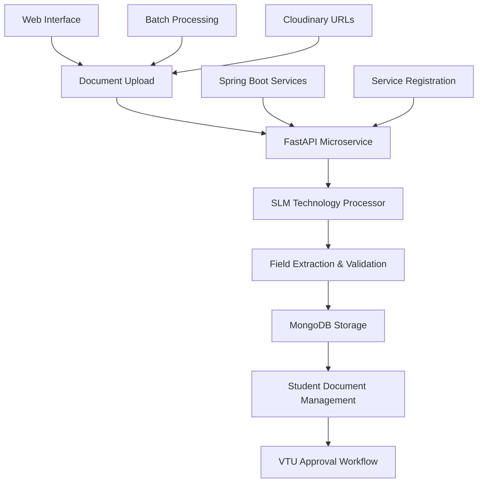

# Smart Document Processor

[](https://github.com/sanjanb/ocr-automation-pipeline/actions)
[](https://www.python.org/downloads/)
[](https://fastapi.tiangolo.com)
[](https://opensource.org/licenses/MIT)


> **AI-powered document processing microservice using advanced SLM technology with FastAPI**  
> Complete OCR automation pipeline with MongoDB storage, batch processing, and VTU approval workflows.

## **What This Does**

- **SLM Technology Integration**: Advanced Small Language Model processing with confidence scoring and validation
- **Lightning Fast**: 2-5 second processing with async FastAPI endpoints
- **MongoDB Storage**: Complete student document management with VTU approval workflows
- **Batch Processing**: Process multiple documents from URIs with callback support
- **Service Integration**: Microservice architecture with Spring Boot integration capabilities
- **Production Ready**: Docker deployment with health checks and monitoring
- **Advanced Features**: Cloudinary integration, document validation, and approval tracking

## **Quick Start**

### **Option 1: Direct Installation**

```bash
# 1. Clone repository
git clone https://github.com/sanjanb/ocr-automation-pipeline.git
cd ocr-automation-pipeline

# 2. Install dependencies
pip install -r requirements.txt

# 3. Set up environment (copy from template and update)
cp .env.example .env
# Edit .env file with your MongoDB URL - SLM model is pre-configured
echo "MONGODB_URL=your_mongodb_connection_string" >> .env

# 4. Run the application
uvicorn app:app --reload

# 5. Open browser
# Web UI: http://localhost:8000
# API Docs: http://localhost:8000/docs
```

### **Option 2: Docker**

```bash
# 1. Clone and build
git clone https://github.com/sanjanb/ocr-automation-pipeline.git
cd ocr-automation-pipeline

# 2. Run with Docker Compose
cp .env.example .env
# Edit .env with your MongoDB URL - SLM model is pre-configured
docker-compose up -d

# 3. Access application
# Web UI: http://localhost:8000
# Health Check: http://localhost:8000/health
```

### **SLM Model Configuration**

The system comes with a pre-configured Small Language Model that provides:
- **Intelligent Document Processing**: Advanced AI-powered text extraction
- **Multi-Format Support**: Handles images and PDFs seamlessly  
- **Confidence Scoring**: Built-in accuracy assessment
- **Auto Document Detection**: Smart document type identification

*No additional setup required - the SLM model is ready to use out of the box*

## **Architecture**



## **Supported Documents**

| Document                  | Required Fields                         | Validation Rules       | Use Case              |
| ------------------------- | --------------------------------------- | ---------------------- | --------------------- |
| **Aadhaar Card**          | Name, Number, DOB, Address              | 12-digit validation    | Identity verification |
| **10th/12th Marksheet**   | Student, Roll No, Board, Year, Subjects | Grade validation       | Academic verification |
| **Transfer Certificate**  | Student, Father, School, Class          | Date format validation | School transfers      |
| **Migration Certificate** | Student, University, Course             | Year validation        | University transfers  |
| **Entrance Scorecard**    | Candidate, Exam, Score, Rank            | Numeric validation     | Competitive exams     |
| **Admit Card**            | Candidate, Exam, Date, Center           | Date/time validation   | Exam identification   |
| **Caste Certificate**     | Name, Father, Caste, Category           | Category validation    | Government benefits   |
| **Domicile Certificate**  | Name, State, District                   | Geographic validation  | Residence proof       |

## **Microservice Features**

### **Core Processing**

- **SLM Technology Integration**: Direct image-to-JSON extraction with confidence scoring using advanced Small Language Models
- **Multi-format Support**: Images (JPG, PNG, WebP, GIF) and PDF documents
- **Auto Document Detection**: AI-powered document type identification
- **Field Validation**: Schema-based validation with custom rules per document type

### **Student Document Management**

- **MongoDB Storage**: Complete student document repository with versioning
- **Document Lifecycle**: Track processing status, approval workflows, and updates
- **VTU Integration**: Approval workflow management for university processes
- **Batch Operations**: Process multiple students' documents efficiently

### **Service Integration**

- **RESTful APIs**: Comprehensive endpoints for document processing and retrieval
- **Service Registration**: Dynamic service discovery and health monitoring
- **Callback Support**: Webhook notifications for async processing completion
- **Spring Boot Ready**: Seamless integration with Java-based microservices

### **Production Features**

- **Async Processing**: Non-blocking operations with FastAPI async support
- **Health Monitoring**: Comprehensive health checks and service status
- **Error Handling**: Graceful error recovery with detailed error reporting
- **Rate Limiting**: Built-in request throttling and resource protection

### **Cloud Integration**

- **Cloudinary Support**: Direct processing from cloud-hosted document URLs
- **MongoDB Atlas**: Cloud database integration with connection pooling
- **Container Ready**: Docker and Kubernetes deployment configurations
- **Scalable Architecture**: Horizontal scaling with load balancing support

## **� API Endpoints**

### **Document Processing**

| Endpoint                 | Method | Description                      | Use Case                    |
| ------------------------ | ------ | -------------------------------- | --------------------------- |
| `/api/process`           | POST   | Process single uploaded document | File upload processing      |
| `/api/process/documents` | POST   | Batch process from URIs          | Cloudinary batch processing |
| `/process-doc`           | POST   | Microservice document processing | Spring Boot integration     |
| `/api/fetch-and-process` | POST   | MongoDB collection processing    | Database batch processing   |

### **Student Management**

| Endpoint                          | Method | Description                 | Response                  |
| --------------------------------- | ------ | --------------------------- | ------------------------- |
| `/students/{id}/documents`        | GET    | Get all student documents   | Complete document history |
| `/students/{id}/documents/{type}` | GET    | Get specific document type  | Latest document of type   |
| `/students/{id}/vtu-approval`     | PUT    | Update VTU approval status  | Approval confirmation     |
| `/students/{id}/status`           | GET    | Get student approval status | Current approval state    |

### **Service Management**

| Endpoint               | Method | Description               | Purpose                   |
| ---------------------- | ------ | ------------------------- | ------------------------- |
| `/service-info`        | GET    | Get service configuration | Service discovery         |
| `/register-service`    | POST   | Register external service | Microservice registration |
| `/registered-services` | GET    | List registered services  | Service inventory         |
| `/health`              | GET    | Service health check      | Monitoring & alerts       |

### **Administrative**

| Endpoint               | Method | Description            | Admin Use             |
| ---------------------- | ------ | ---------------------- | --------------------- |
| `/approved-students`   | GET    | List approved students | Admin dashboard       |
| `/all-students-status` | GET    | All students status    | System overview       |
| `/schemas`             | GET    | Document schemas       | Integration reference |

## **Integration Examples**

### **Process Single Document**

```python
import requests

# Upload and process with student storage
with open("document.jpg", "rb") as f:
    response = requests.post(
        "http://localhost:8000/api/process",
        files={"file": f},
        data={
            "document_type": "aadhaar_card",
            "student_id": "STUDENT_123"  # Optional: Store in MongoDB
        }
    )

result = response.json()
print(f"Confidence: {result['confidence_score']:.1%}")
print(f"Stored in MongoDB: {result['metadata']['mongodb_stored']}")
print(f"Data: {result['extracted_data']}")
```

### **Microservice Batch Processing**

```python
import requests

# Process documents from Cloudinary URLs
response = requests.post(
    "http://localhost:8000/api/process/documents",
    json={
        "document_uris": [
            "https://res.cloudinary.com/dal5z9kro/image/upload/doc1.jpg",
            "https://res.cloudinary.com/dal5z9kro/image/upload/doc2.jpg"
        ],
        "student_id": "STUDENT_123",
        "document_type": "aadhaar_card",
        "batch_name": "admission_batch_2025",
        "callback_url": "http://your-service.com/webhook"
    }
)

result = response.json()
print(f"Processed: {result['processed_documents']}/{result['total_documents']}")
print(f"Results: {result['results']}")
```

### **Microservice Document Processing**

```python
# Process document from Cloudinary URL
response = requests.post(
    "http://localhost:8000/process-doc",
    json={
        "studentId": "STUDENT_123",
        "docType": "aadhaar_card",
        "cloudinaryUrl": "https://res.cloudinary.com/dal5z9kro/image/upload/doc.jpg"
    }
)

# Get student documents
response = requests.get("http://localhost:8000/students/STUDENT_123/documents")
student_data = response.json()

# Update VTU approval status
response = requests.put(
    "http://localhost:8000/students/STUDENT_123/vtu-approval",
    json={"vtuApproved": True, "vtuResponse": {"status": "approved"}}
)
```

### **Sample Response**

```json
{
  "success": true,
  "studentId": "STUDENT_123",
  "savedDocument": {
    "docType": "aadhaar_card",
    "cloudinaryUrl": "https://res.cloudinary.com/dal5z9kro/image/upload/doc.jpg",
    "fields": {
      "name": "John Doe",
      "aadhaar_number": "1234 5678 9012",
      "date_of_birth": "15/08/1995"
    },
    "confidence": 0.92,
    "processedAt": "2025-01-01T10:30:00Z"
  }
}
```

## **Testing**

```bash
# Run all tests
pytest tests/ -v

# Run with coverage
pytest tests/ --cov=src --cov-report=html

# Run specific test file
pytest tests/test_api.py -v

# Test with mock data
python -m pytest tests/test_core.py::TestDocumentProcessor::test_process_document_success
```

## **Deployment**

### **Production Deployment**

```bash
# 1. Build production image
docker build -t document-processor:latest .

# 2. Run with production settings
docker run -d \
  -p 8000:8000 \
  -e MONGODB_URL=your_mongodb_url \
  -e DEBUG=false \
  -e LOG_LEVEL=INFO \
  --name document-processor \
  document-processor:latest

# 3. Check health
curl http://localhost:8000/health
```

### **Cloud Deployment**

- **AWS**: Deploy to ECS, Lambda, or Elastic Beanstalk
- **Google Cloud**: Deploy to Cloud Run or App Engine
- **Azure**: Deploy to Container Instances or App Service
- **Heroku**: One-click deployment with buildpacks

## **Performance Benchmarks**

| Metric              | This Solution    | Traditional OCR Pipeline |
| ------------------- | ---------------- | ------------------------ |
| **Processing Time** | 2-5 seconds      | 15-30 seconds            |
| **Accuracy**        | 85-95%           | 70-85%                   |
| **Setup Time**      | 2 minutes        | 30+ minutes              |
| **Dependencies**    | <100MB           | 1GB+                     |
| **API Calls**       | 1 call           | 3-5 calls                |
| **Infrastructure**  | Serverless ready | Requires GPU/CPU         |

## **Development**

### **Project Structure**

```
ocr-automation-pipeline/
├── src/document_processor/     # Core processing logic
│   ├── core.py                # SLM Technology processor
│   ├── schemas.py             # Document schemas & validation
│   ├── models.py              # Pydantic models
│   ├── database.py            # MongoDB integration
│   ├── normalizer.py          # Field normalization
│   ├── cloudinary_service.py  # Cloudinary integration
│   └── config.py              # Configuration management
├── tests/                     # Comprehensive test suite
├── assets/test_docs/          # Sample documents for testing
├── Docs/                      # Documentation & guides
├── app.py                     # FastAPI microservice (2000+ lines)
├── Dockerfile                 # Production container
├── docker-compose.yml         # Development environment
├── .env.example               # Configuration template
└── requirements.txt           # Python dependencies
```

### **Contributing**

1. Fork the repository
2. Create feature branch (`git checkout -b feature/amazing-feature`)
3. Commit changes (`git commit -m 'Add amazing feature'`)
4. Push to branch (`git push origin feature/amazing-feature`)
5. Open Pull Request

### **Code Quality**

- **Linting**: `flake8`, `black`, `isort`
- **Type Checking**: `mypy`
- **Testing**: `pytest` with >90% coverage
- **Security**: `bandit`, `safety`

## **Demo Features**

### **Web Interface**

- **Modern Responsive Design**: Mobile-optimized document upload interface
- **Real-time Processing**: Live updates with processing status and progress
- **Student ID Integration**: Optional student ID for automatic MongoDB storage
- **Confidence Visualization**: Visual confidence scoring with validation issues
- **MongoDB Storage Status**: Clear indication of database storage success
- **Professional UI**: Production-ready interface suitable for demonstrations

### **Microservice Dashboard**

- **Service Health Monitoring**: Real-time health checks and status monitoring
- **Processing Metrics**: Performance analytics and processing statistics
- **Student Management**: Complete student document lifecycle management
- **Batch Processing Status**: Monitor large-scale document processing operations
- **Error Tracking**: Comprehensive error logging and debugging information

### **API Documentation**

- **Interactive Swagger UI**: Complete OpenAPI 3.0 specification with try-it-out
- **ReDoc Documentation**: Professional API reference documentation
- **Schema Validation**: Request/response schemas with validation rules
- **Integration Examples**: Ready-to-use code samples for all endpoints
- **Authentication Guides**: Security implementation examples

### **Monitoring & Debugging**

- Structured logging
- Health check endpoints
- Processing metrics
- Error tracking

## **Why Choose This Microservice?**

### **For Hackathons**

- **Instant Setup**: Production-ready in under 5 minutes with Docker
- **Impressive Demo**: Complete document management system with AI processing
- **Judge Appeal**: Modern microservice architecture with comprehensive features
- **Mobile Ready**: Responsive interface works on all devices
- **Technical Depth**: Advanced features like VTU workflows and service integration

### **For Production**

- **Microservice Architecture**: Scalable, maintainable, and production-tested
- **High Performance**: Async FastAPI with sub-5-second processing
- **Enterprise Security**: Input validation, error handling, and audit trails
- **Observable**: Comprehensive logging, health monitoring, and metrics
- **Integration Ready**: Spring Boot compatible with service registration

### **For Developers**

- **Modern Python**: Type hints, async/await, Pydantic v2, FastAPI latest
- **Test Coverage**: Comprehensive test suite with >90% coverage
- **Documentation**: Complete API docs, deployment guides, and examples
- **Extensible**: Plugin architecture with configurable processing pipelines
- **CI/CD Ready**: GitHub Actions, Docker builds, and automated deployments

## **Support**

- **Issues**: [GitHub Issues](https://github.com/sanjanb/ocr-automation-pipeline/issues)
- **Discussions**: [GitHub Discussions](https://github.com/sanjanb/ocr-automation-pipeline/discussions)
- **Documentation**: [Wiki](https://github.com/sanjanb/ocr-automation-pipeline/wiki)
- **Examples**: [Examples Repository](https://github.com/sanjanb/ocr-automation-pipeline/tree/main/examples)

---

**Built with love for MIT Hackathon 2025**  
_Transform documents, not just extract text_
