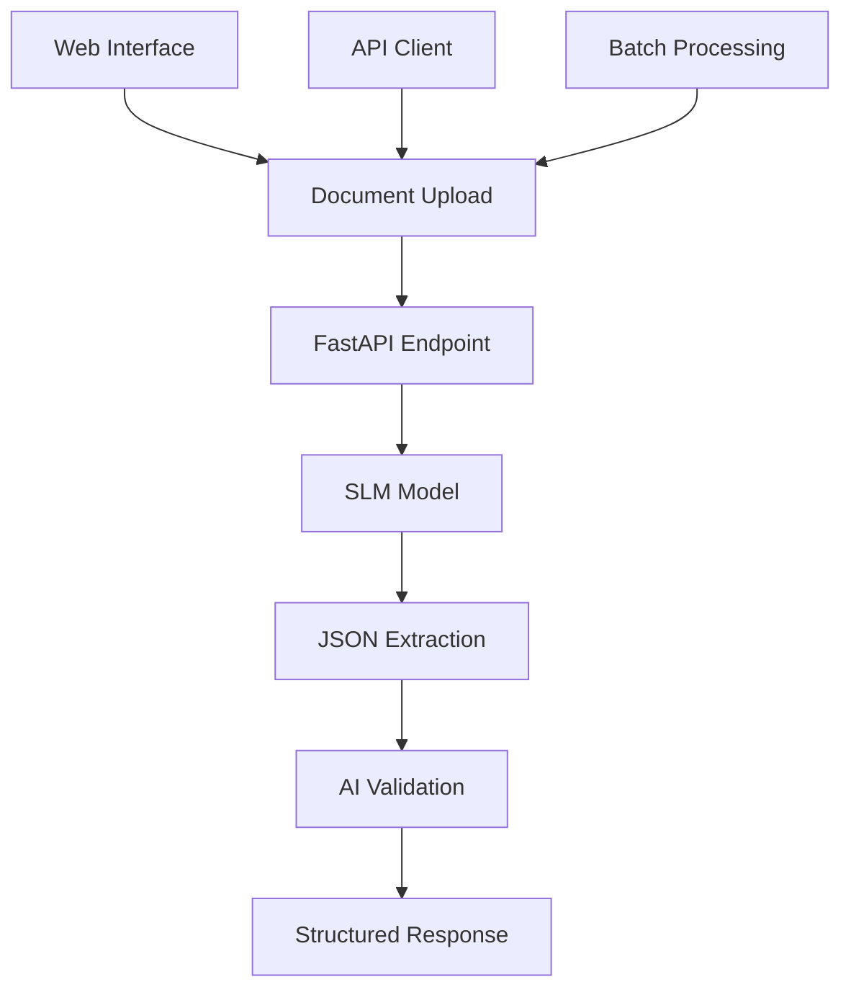

# Smart Document Processor

[](https://github.com/sanjanb/ocr-automation-pipeline/actions)
[](https://www.python.org/downloads/)
[](https://fastapi.tiangolo.com)
[](https://opensource.org/licenses/MIT)


> **AI-powered document processing using SLM Model with FastAPI**  
> Transform document images into structured JSON in seconds, not hours.

## **What This Does**

- **Direct AI Processing**: SLM Model reads images and extracts structured data in one step
- **Lightning Fast**: 2-5 second processing vs traditional 30+ second OCR pipelines
- **Smart Validation**: AI-powered completeness checking and error detection
- **Production Ready**: FastAPI with automatic documentation, async support, and Docker deployment
- **Developer Friendly**: Modern Python, comprehensive tests, and CI/CD pipeline

## **Quick Start**

### **Option 1: Direct Installation**

```bash
# 1. Clone repository
git clone https://github.com/sanjanb/ocr-automation-pipeline.git
cd ocr-automation-pipeline

# 2. Install dependencies
pip install -r requirements.txt

# 3. Set up environment
echo "GEMINI_API_KEY=your_slm_api_key_here" > .env

# 4. Run the application
uvicorn app:app --reload

# 5. Open browser
# Web UI: http://localhost:8000
# API Docs: http://localhost:8000/docs
```

### **Option 2: Docker**

```bash
# 1. Clone and build
git clone https://github.com/sanjanb/ocr-automation-pipeline.git
cd ocr-automation-pipeline

# 2. Run with Docker Compose
echo "GEMINI_API_KEY=your_slm_api_key_here" > .env
docker-compose up -d

# 3. Access application
# Web UI: http://localhost:8000
# Health Check: http://localhost:8000/health
```

### **Get SLM API Key**

1. Obtain your SLM model API key from your provider
2. Create new project and API key
3. Copy key to your `.env` file

## **Architecture**



## **Supported Documents**

| Document                     | Required Fields                         | Validation Rules       | Use Case              |
| ---------------------------- | --------------------------------------- | ---------------------- | --------------------- |
| 🆔 **Aadhaar Card**          | Name, Number, DOB, Address              | 12-digit validation    | Identity verification |
| 📜 **10th/12th Marksheet**   | Student, Roll No, Board, Year, Subjects | Grade validation       | Academic verification |
| 📄 **Transfer Certificate**  | Student, Father, School, Class          | Date format validation | School transfers      |
| 🎓 **Migration Certificate** | Student, University, Course             | Year validation        | University transfers  |
| 📊 **Entrance Scorecard**    | Candidate, Exam, Score, Rank            | Numeric validation     | Competitive exams     |
| 🎫 **Admit Card**            | Candidate, Exam, Date, Center           | Date/time validation   | Exam identification   |
| 📋 **Caste Certificate**     | Name, Father, Caste, Category           | Category validation    | Government benefits   |
| 🏠 **Domicile Certificate**  | Name, State, District                   | Geographic validation  | Residence proof       |

## 🔌 **API Usage**

### **Process Single Document**

```python
import requests

# Upload and process
with open("document.jpg", "rb") as f:
    response = requests.post(
        "http://localhost:8000/api/process",
        files={"file": f},
        data={"document_type": "aadhaar_card"}
    )

result = response.json()
print(f"Confidence: {result['confidence_score']:.1%}")
print(f"Data: {result['extracted_data']}")
```

### **Batch Processing**

```python
import asyncio
import aiohttp

async def process_documents(file_paths):
    async with aiohttp.ClientSession() as session:
        tasks = []
        for file_path in file_paths:
            task = process_single_document(session, file_path)
            tasks.append(task)

        results = await asyncio.gather(*tasks)
        return results

# Process multiple documents concurrently
results = asyncio.run(process_documents(["doc1.jpg", "doc2.jpg"]))
```

### **Validation Results**

```json
{
  "success": true,
  "document_type": "aadhaar_card",
  "extracted_data": {
    "name": "John Doe",
    "aadhaar_number": "1234 5678 9012",
    "date_of_birth": "15/08/1995",
    "address": "123 Main Street, Bangalore, Karnataka"
  },
  "confidence_score": 0.92,
  "validation_issues": [],
  "processing_time": 2.1,
  "model_used": "slm-model-default"
}
```

## 🧪 **Testing**

```bash
# Run all tests
pytest tests/ -v

# Run with coverage
pytest tests/ --cov=src --cov-report=html

# Run specific test file
pytest tests/test_api.py -v

# Test with mock data
python -m pytest tests/test_core.py::TestDocumentProcessor::test_process_document_success
```

## **Deployment**

### **Production Deployment**

```bash
# 1. Build production image
docker build -t document-processor:latest .

# 2. Run with production settings
docker run -d \
  -p 8000:8000 \
  -e SLM_API_KEY=your_slm_api_key \
  -e DEBUG=false \
  -e LOG_LEVEL=INFO \
  --name document-processor \
  document-processor:latest

# 3. Check health
curl http://localhost:8000/health
```

### **Cloud Deployment**

- **AWS**: Deploy to ECS, Lambda, or Elastic Beanstalk
- **Google Cloud**: Deploy to Cloud Run or App Engine
- **Azure**: Deploy to Container Instances or App Service
- **Heroku**: One-click deployment with buildpacks

## 📈 **Performance Benchmarks**

| Metric              | This Solution    | Traditional OCR Pipeline |
| ------------------- | ---------------- | ------------------------ |
| **Processing Time** | 2-5 seconds      | 15-30 seconds            |
| **Accuracy**        | 85-95%           | 70-85%                   |
| **Setup Time**      | 2 minutes        | 30+ minutes              |
| **Dependencies**    | <100MB           | 1GB+                     |
| **API Calls**       | 1 call           | 3-5 calls                |
| **Infrastructure**  | Serverless ready | Requires GPU/CPU         |

## 🛠️ **Development**

### **Project Structure**

```
ocr-automation-pipeline/
├── src/document_processor/     # Core processing logic
│   ├── core.py                # Main processor class
│   ├── schemas.py             # Document schemas
│   └── config.py              # Configuration management
├── tests/                     # Comprehensive test suite
├── .github/workflows/         # CI/CD pipeline
├── app.py                     # FastAPI application
├── Dockerfile                 # Container configuration
├── docker-compose.yml         # Local development
└── requirements.txt           # Dependencies
```

### **Contributing**

1. Fork the repository
2. Create feature branch (`git checkout -b feature/amazing-feature`)
3. Commit changes (`git commit -m 'Add amazing feature'`)
4. Push to branch (`git push origin feature/amazing-feature`)
5. Open Pull Request

### **Code Quality**

- **Linting**: `flake8`, `black`, `isort`
- **Type Checking**: `mypy`
- **Testing**: `pytest` with >90% coverage
- **Security**: `bandit`, `safety`

## **Demo Features**

### **Web Interface**

- Modern, responsive design
- Mobile-friendly upload
- Real-time processing updates
- Confidence scoring
- Validation issue highlighting
- JSON export functionality

### **API Documentation**

- Interactive Swagger UI
  ReDoc documentation
- 🔧 Request/response schemas
- Try-it-out functionality

### **Monitoring & Debugging**

- Structured logging
- Health check endpoints
- Processing metrics
- Error tracking

## **Why Choose This Solution?**

### **For Hackathons**

- **Quick Setup**: Demo ready in 2 minutes
- **Impressive Results**: High accuracy, fast processing
- **Professional UI**: Judge-ready interface
- **Technical Depth**: Modern architecture, comprehensive features

### **For Production**

- **Scalable**: Async FastAPI, containerized
- **Secure**: Input validation, error handling
- **Observable**: Logging, monitoring, health checks
- **Maintainable**: Clean code, comprehensive tests

### **For Developers**

- **Modern Python**: Type hints, async/await, Pydantic
- **Well Tested**: >90% coverage, CI/CD pipeline
  **Documented**: Comprehensive docs, API specs
- **Extensible**: Plugin architecture, configurable

## **Support**

- 🐛 **Issues**: [GitHub Issues](https://github.com/sanjanb/ocr-automation-pipeline/issues)
- 💬 **Discussions**: [GitHub Discussions](https://github.com/sanjanb/ocr-automation-pipeline/discussions)
- **Documentation**: [Wiki](https://github.com/sanjanb/ocr-automation-pipeline/wiki)
- **Examples**: [Examples Repository](https://github.com/sanjanb/ocr-automation-pipeline/tree/main/examples)

---

**Built with ❤️ for MIT Hackathon 2025**  
_Transform documents, not just extract text_
